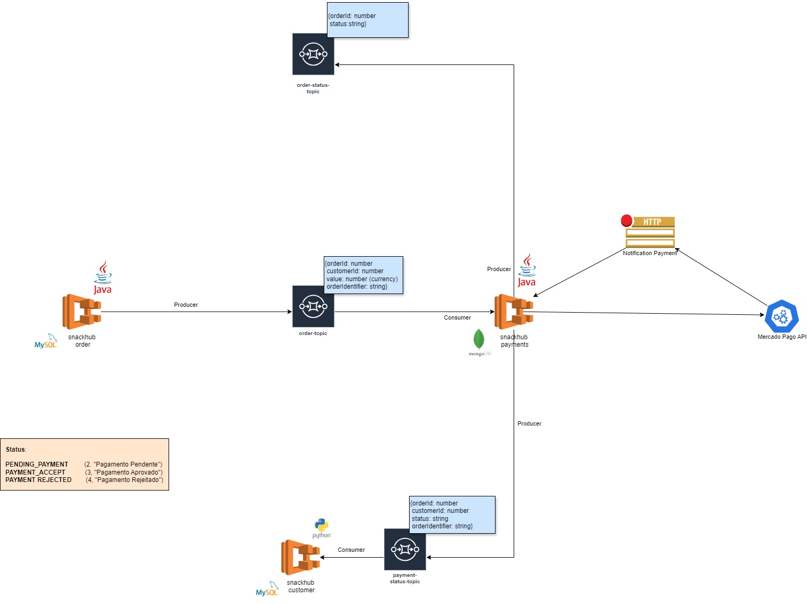
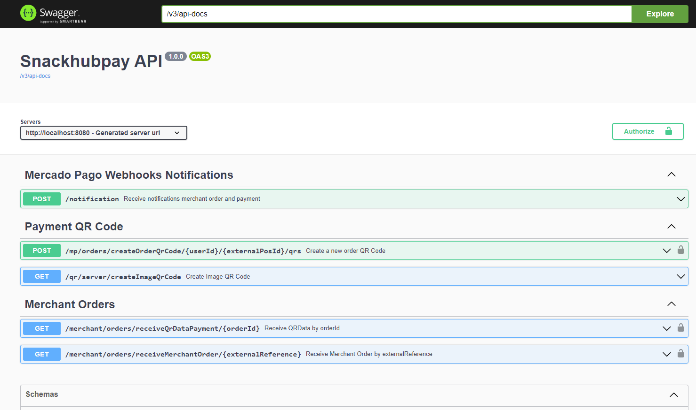

<center>
  <p align="center">
    
    
  </p>  
  <h1 align="center">MS SnackHub Pay com Clean Architecture</h1>
  <br align="center">
    Este projeto tem a finalidade educacional de um Microserviço responsável por receber um pedido de um estabelecimento de lanchonete e gerar o QRCode de pagamento do pedido realizando integração com o Mercado Pago, 
como parte do Tech Challenge do Curso de Arquitetura de Software.
</center>

# Conceito

## O que é Clean Architecture?

Clean Architecture, também conhecida como Arquitetura Limpa, é uma abordagem de desenvolvimento de software proposta por Robert C. Martin, um renomado engenheiro de software, autor e consultor. A principal ideia por trás da Clean Architecture é criar sistemas que sejam independentes de frameworks, banco de dados e detalhes de interface do usuário, enfatizando a separação de preocupações e a clareza na organização do código.

O objetivo da Clean Architecture é desenvolver sistemas altamente sustentáveis, testáveis e escaláveis, facilitando a manutenção contínua ao longo do tempo, permitindo a troca de componentes sem alterar a lógica central e tornando o código mais compreensível para novos desenvolvedores que trabalham no projeto.

Essa arquitetura promove a separação de preocupações e permite que cada camada se concentre em sua responsabilidade específica. A ideia é que as dependências fluam de dentro para fora, ou seja, as camadas internas não devem depender das camadas externas, tornando o sistema mais modular e independente.


## Decisão Arquitetural do Desafio

O projeto SnackHub possui três principais módulos:
* Domain
* Application
* Infrastructure

## Domain

Nesse módulo estão presentes as nossas classes de dominio, projetadas com a utilização de práticas do DDD.
No cenário do Clean Architecture representam as Entities.

As classes presentes nesse módulo não possuem nenhuma dependência externa ou de framework.

## Application

A camada de Use Case é responsável por implementar os casos de uso específicos do negócio da aplicação.
A caracteristica desse módulo é abstrair de regras de negócio: A camada de Use Case contém a lógica do negócio da aplicação, mas sem detalhes de implementação relacionados a infraestrutura ou apresentação.

## Infrastructure

A camada de infraestrutura é uma das camadas principais do Clean Architecture (Arquitetura Limpa) proposta por Robert C. Martin.
Essa camada é responsável por lidar com os detalhes técnicos, como o acesso a bancos de dados, serviços externos, sistemas de arquivos e outras tecnologias que não são específicas do domínio da aplicação. Sua principal função é permitir a comunicação entre a aplicação e o mundo externo, mantendo a lógica de negócio isolada e independente de detalhes de implementação.

# Persistência
No microserviço estamos utilizando um banco de dados NOSQL MongoDB.


# Tech Challenge 5

### Desenho da Arquitetura
#### Escolhendo a abordagem coreografada no padrão SAGA de microserviços


### O que é o padrão SAGA?
O padrão SAGA é uma técnica para manter a consistência dos dados em sistemas distribuídos, especialmente em arquiteturas de microserviços. O padrão foi criado com o desafio das transações distribuídas, onde uma operação pode envolver vários serviços que precisam ser coordenados de forma consistente.

Existem duas abordagens principais dentro do padrão SAGA:  coreografia e orquestração

Coreografia: Os serviços colaboram entre si, sem a necessidade de um controlador central. Cada serviço é responsável por suas próprias ações e reage a eventos gerados por outros serviços.

Orquestração: Envolve um serviço centralizado (geralmente chamado de orquestrador) que coordena e controla as transações entre os serviços participantes.

### Vantagem da abordagem coreografada no padrão SAGA?

- Desacoplamento: A abordagem coreografada promove um maior desacoplamento entre os serviços. Cada serviço conhece apenas as interações com os outros serviços com os quais precisa se comunicar diretamente. Isso facilita a manutenção, escalabilidade e evolução do sistema, já que as mudanças em um serviço têm menos impacto nos outros.

- Escalabilidade: Como não há um ponto central de coordenação, a abordagem coreografada pode ser mais escalável em ambientes onde a carga é distribuída de forma desigual entre os serviços. Cada serviço pode escalar independentemente para atender à demanda.

- Resiliência: A coreografia distribui a lógica de coordenação entre os serviços participantes. Isso significa que o sistema pode continuar funcionando mesmo se alguns serviços estiverem inativos, desde que outros serviços ainda possam operar independentemente.

- Flexibilidade: A abordagem coreografada é mais flexível em termos de evolução do sistema. Novos serviços podem ser adicionados e serviços existentes podem ser modificados sem a necessidade de alterações significativas no orquestrador central.

- Menos ponto único de falha: Em uma abordagem orquestrada, o orquestrador central pode se tornar um ponto único de falha e um gargalo de desempenho. Na coreografia, não há esse risco, pois não há um ponto centralizado de controle.

### Conclusão

Embora a escolha entre orquestração e coreografia no padrão SAGA dependa das necessidades específicas do sistema, a abordagem coreografada oferece vantagens significativas em termos de desacoplamento, escalabilidade, resiliência, flexibilidade e robustez contra falhas. Ao optar por uma abordagem coreografada, deixamos nossos serviços mais resilientes, flexíveis e escaláveis.

### Desenho da Arquitetura da App SnackHub Pay



1. **Consumo de Mensagem da Fila order-topic (SQS AWS):** O serviço consome mensagens da fila order-topic da AWS para processar os pedidos recebidos.

2. **Integração com o Mercado Pago API:** Após receber uma mensagem da fila, o serviço realiza integração com a API do Mercado Pago para realizar o pagamento do pedido.

3. **Produção do QRData com as Informações da Order:** Com base nas informações do pedido, o serviço produz um QRData contendo os detalhes necessários para o pagamento.

4. **Salvando o QRData na Base de Dados MongoDB:** O QRData gerado é então armazenado na base de dados MongoDB para referência futura.

5. **Publicação de Mensagem na Fila order-status-topic com o Status do Pagamento (PENDING_PAYMENT):** Após salvar o QRData na base de dados, o serviço publica uma mensagem na fila order-status-topic com o status do pagamento como "PENDING_PAYMENT".

6. **Obtenção do QRData da Base de Dados MongoDB:** Quando necessário, o serviço pode obter o QRData da base de dados para processamento adicional.

7. **Produção do QRCode de Pagamento:** Utilizando o QRData obtido, o serviço produz um QRCode de pagamento que será exibido ao cliente.

8. **Realização do Pagamento via App Mercado Pago:** O cliente realiza o pagamento escaneando o QRCode gerado usando o aplicativo do Mercado Pago.

9. **Recebimento de Notificação de Pagamento com Dois Possíveis Status:**
    - **Pagamento Aceito (PAYMENT_ACCEPT):** O serviço recebe uma notificação indicando que o pagamento foi aceito.
    - **Pagamento Rejeitado (PAYMENT_REJECTED):** Da mesma forma, o serviço pode receber uma notificação indicando que o pagamento foi rejeitado.

10. **Publicação de Mensagem nas Filas order-status-topic e payment-status-topic:**
    - Após receber a notificação de pagamento, o serviço publica mensagens nas filas order-status-topic e payment-status-topic.

### Interação da App SnackHub Pay com as Queues:

- **Consumidor da Fila order-topic:** O aplicativo SnackHub Pay consome mensagens da fila order-topic da aplicação order.
- **Produtor da Fila order-status-topic:** O aplicativo SnackHub Pay produz mensagens na fila order-status-topic para a aplicação order.
- **Produtor da Fila payment-status-topic:** O aplicativo SnackHub Pay produz mensagens na fila payment-status-topic para a aplicação customer.

Essa nova fase do projeto adiciona uma interação mais abrangente com as filas, permitindo uma comunicação eficiente entre os diferentes componentes do sistema e uma gestão mais completa dos pedidos e pagamentos.
#### Obs.: O endpoint de criação de pagamento via API foi mantido mesmo após a implementação do padrão SAGA e SQS para fins de teste e validação do fluxo de pagamento.


# OWASP ZAP

## Conceito

OWASP ZAP (Zed Attack Proxy) é uma ferramenta de segurança de código aberto desenvolvida para ajudar desenvolvedores, testadores de segurança e administradores de sistemas a identificar e corrigir vulnerabilidades em aplicativos da web. Ele fornece recursos poderosos para análise de segurança automatizada, testes de penetração e relatórios detalhados de vulnerabilidades.

## Definição

OWASP ZAP é uma ferramenta de segurança de aplicativos da web que oferece funcionalidades como proxy de interceptação, varredura automatizada de segurança, testes de penetração e análise de vulnerabilidades. Ele é mantido pela Open Web Application Security Project (OWASP) e é usado por profissionais de segurança em todo o mundo para melhorar a segurança de aplicativos da web.

## Exemplo de Uso

Para usar o OWASP ZAP em um projeto de desenvolvimento de software:

1. Inicie o OWASP ZAP e configure-o como um proxy no seu navegador.
2. Navegue pelas páginas web do aplicativo que você deseja testar.
3. Use as ferramentas de varredura e teste de penetração do OWASP ZAP para identificar vulnerabilidades de segurança, como Cross-Site Scripting (XSS), Injeção de SQL, entre outros.
4. Analise os relatórios gerados pelo OWASP ZAP e tome medidas para corrigir as vulnerabilidades encontradas.

## Referência

Para mais informações sobre o OWASP ZAP, consulte a [documentação oficial](https://www.owasp.org/index.php/OWASP_Zed_Attack_Proxy_Project).


## Report OWASP ZAP da App SnackHub Pay
* Relatórios de geração e confirmação de pagamento antes e depois da correção de vunerabilidades altas.

### Relatórios de vunerabilidades Zap scanning Report

* [Clique aqui para acessar o relatório da geração do pagamento](readmefiles/report-zap/report-zap-checkout-pg-antes.pdf)
* [Clique aqui para acessar o relatório da Confirmação de pagamento(Webhook)](readmefiles/report-zap/report-webhook-pg-via-ultrahook-antes.pdf)

### Relatórios após correção de vunerabilidades altas Zap scanning Report

* [Clique aqui para acessar o relatório da geração do pagamento](readmefiles/report-zap/repot-zap-checkout-pg-depois.pdf)
* [Clique aqui para acessar o relatório da Confirmação de pagamento(Webhook)](readmefiles/report-zap/report-webhook-pg-via-ultrahook-depois.pdf)


## Executando a App

**1. Pull da image app:**
```shell
docker pull grupo60fiap2023/snackhubpay-app
```
**2. Subir a aplicação e o banco de dados MongoDB com Docker:**
```shell
docker-compose up -d
```


**2. URL de acesso:**

http://localhost:8080/swagger-ui/index.html

**Authorize:**
```shell
APP_USR-3823682881313300-031907-0ade7b50918de2f2c67c6970abe3ced9-1589696702
```



**3. Ultrahook para simular Webhook:**
```shell
ultrahook -k nHfMDsNNaRJvWEQAuqFNXYxrQuW8R8Sc mercadopago 8080/notification
```


Referência: https://www.ultrahook.com/


**4. Usuario comprador teste MP:**

**User:**
```shell
TESTUSER196316317
```
**Password:**
```shell
z9nB7nGQS6
```

**5. Captura do fluxo de pagamento:**

*Fluxo de PG:*
[](https://youtu.be/MBjZx_qpbi4)
* No minuto 1:02 é gerado o QRCode, o momento do pagamento está na captura abaixo.

*PG da order via App MP:*
[](https://youtu.be/B9TpFiiMMSI)

**6. Webhook Notification:**

